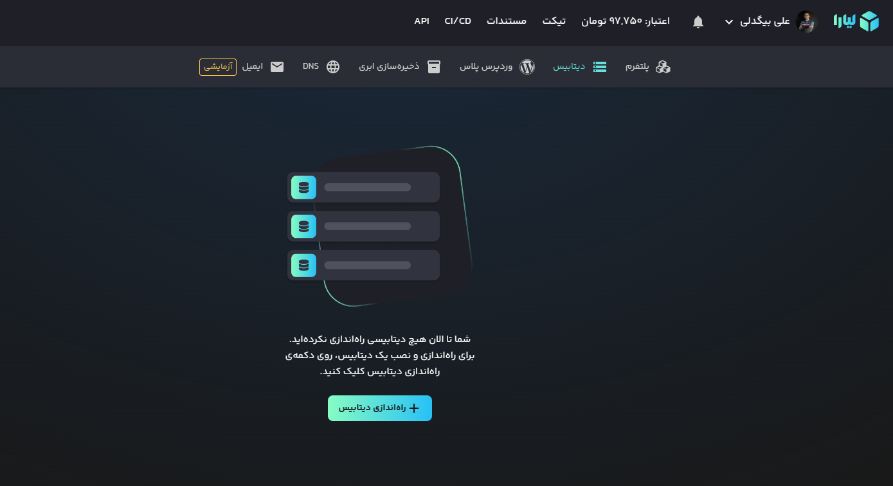
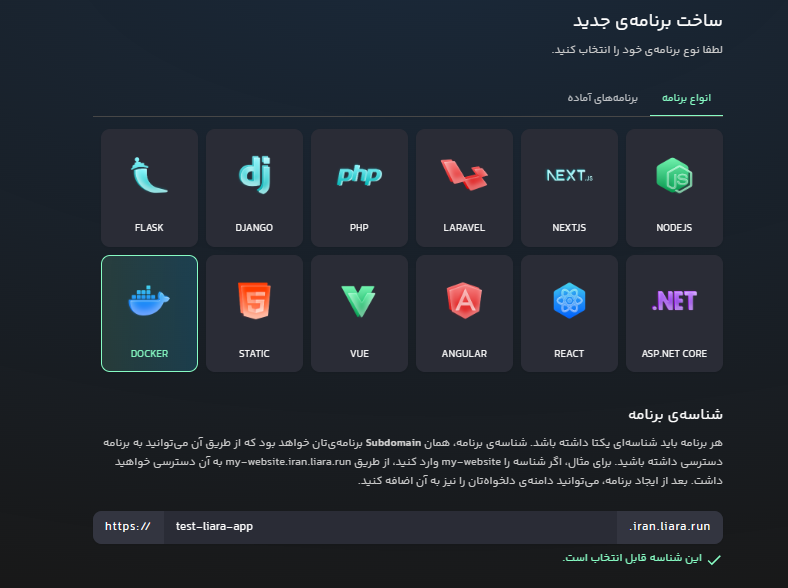
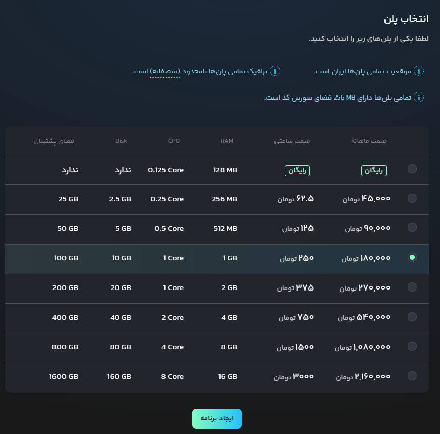
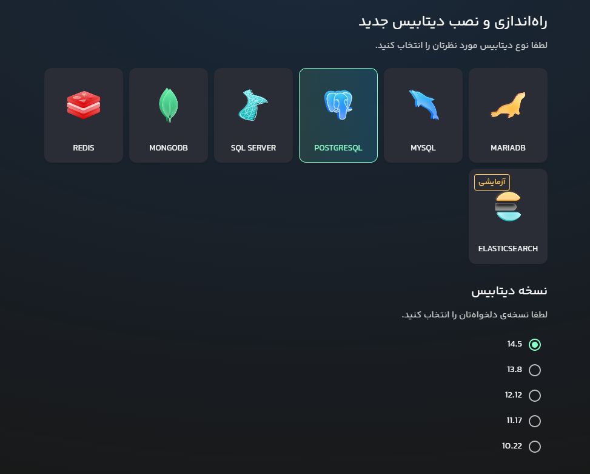
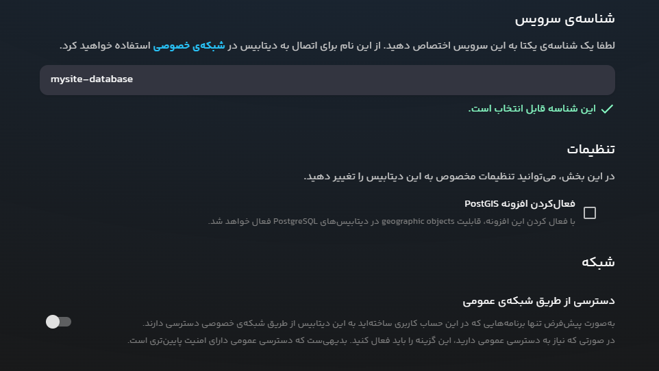
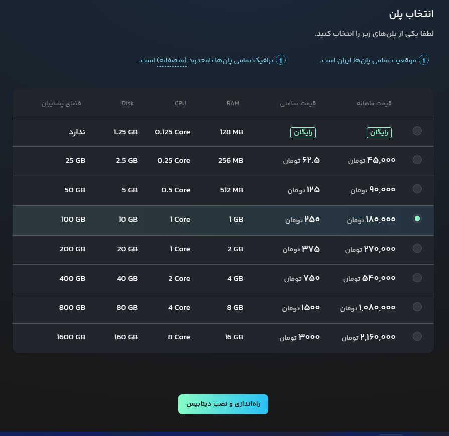
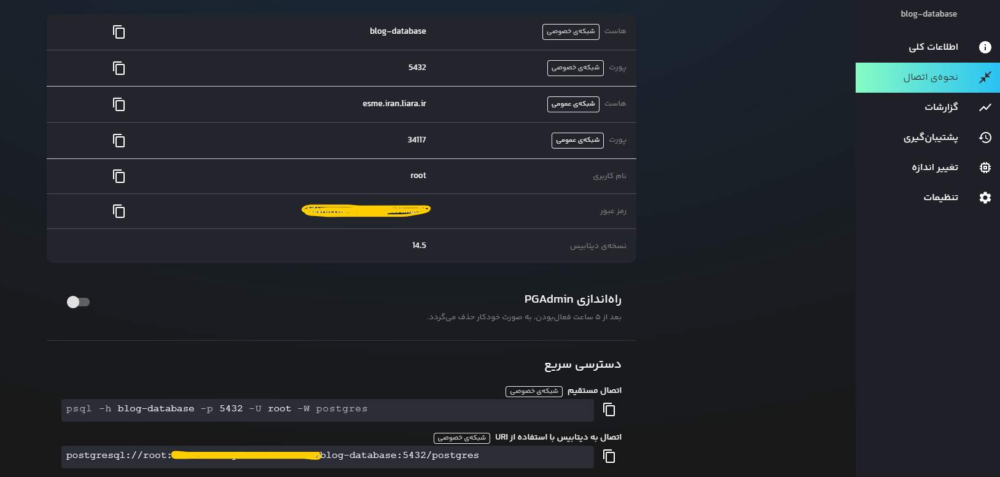
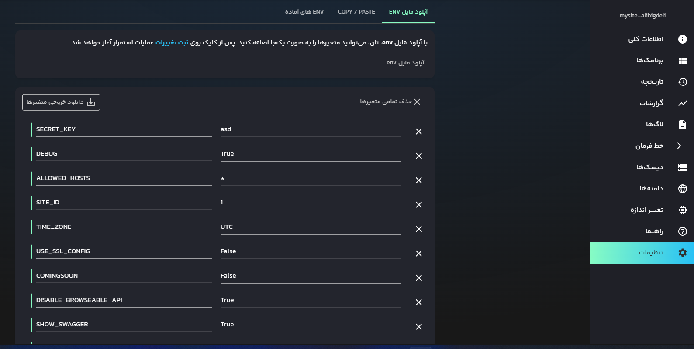
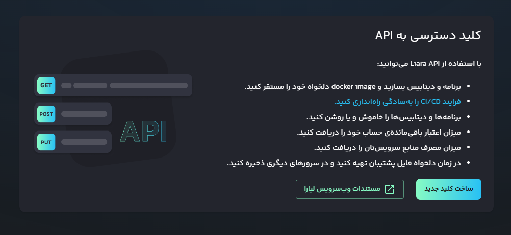

<div align="center">

<h1 align="center">Django3.2 Liara Template</h1>
<h3 align="center">Sample Project to use Liara service provider for django app</h3>
</div>
<p align="center">
<a href="https://www.python.org" target="_blank">  </a>
<a href="https://www.djangoproject.com/" target="_blank">  </a> 
<a href="https://www.docker.com/" target="_blank">  </a>
<a href="https://www.postgresql.org" target="_blank">  </a>
<a href="https://www.nginx.com" target="_blank">  </a>
<a href="https://git-scm.com/" target="_blank">  </a>
<a href="https://liara.ir" target="_blank">  </a>
</p>

# Guideline
- [Guideline](#guideline)
- [Goal](#goal)
- [Video Instructions](#video-instructions)
- [Development usage](#development-usage)
  - [Clone the repo](#clone-the-repo)
  - [Enviroment Varibales](#enviroment-varibales)
  - [Build everything](#build-everything)
  - [Note](#note)
  - [Check it out in a browser](#check-it-out-in-a-browser)
- [Testing Usage](#testing-usage)
  - [running all tests](#running-all-tests)
- [Liara deployment](#liara-deployment)
  - [0- Create an account](#0--create-an-account)
  - [1- Create a docker app](#1--create-a-docker-app)
  - [2- Setup database](#2--setup-database)
  - [3- Setup django app](#3--setup-django-app)
    - [setup environment](#setup-environment)
    - [upload the app](#upload-the-app)
- [CICD Deployment](#cicd-deployment)
  - [Github CICD](#github-cicd)
  - [Gitlab/Hamgit CICD](#gitlabhamgit-cicd)
- [License](#license)
- [Bugs](#bugs)

# Goal
This project main goal is to provide a simple way to deploy a django project into liara service provider.

# Video Instructions
<div align="center" ></div>

# Development usage
You'll need to have [Docker installed](https://docs.docker.com/get-docker/).
It's available on Windows, macOS and most distros of Linux. 

If you're using Windows, it will be expected that you're following along inside
of [WSL or WSL
2](https://nickjanetakis.com/blog/a-linux-dev-environment-on-windows-with-wsl-2-docker-desktop-and-more).

That's because we're going to be running shell commands. You can always modify
these commands for PowerShell if you want.


## Clone the repo
Clone this repo anywhere you want and move into the directory:
```bash
git clone https://github.com/AliBigdeli/Django-Liara-Docker-Template.git
```

## Enviroment Varibales
enviroment varibales are included in docker-compose.yml file for debugging mode and you are free to change commands inside:

```yaml
services:
  backend:
    command: sh -c "python manage.py check_database && \ 
                    yes | python manage.py makemigrations  && \
                    yes | python manage.py migrate  && \
                    python manage.py runserver 0.0.0.0:8000"
    environment:      
      - DEBUG=True
```

## Build everything

*The first time you run this it's going to take 5-10 minutes depending on your
internet connection speed and computer's hardware specs. That's because it's
going to download a few Docker images and build the Python + requirements dependencies.*

```bash
docker compose up --build
```

Now that everything is built and running we can treat it like any other Django
app.

## Note

If you receive an error about a port being in use? Chances are it's because
something on your machine is already running on port 8000. then you have to change the docker-compose.yml file according to your needs.
## Check it out in a browser

Visit <http://localhost:8000> in your favorite browser.

# Testing Usage
## running all tests
```bash
docker compose run --rm backend sh -c " black -l 79 && flake8 && python manage.py test" -v core:/app
```
or
```bash
docker compose exec backend sh -c sh -c " black -l 79 && flake8 && python manage.py test" 
```

# Liara deployment

## 0- Create an account
in order to deploy your project inside Liara first you need to create an account. so please go to the following url and create your account.

<https://console.liara.ir/register>

after that you need to sign in to your console panel. which is going to be like this.
<div align="center" ></div>

## 1- Create a docker app
in order to deploy your project first you have to create the platform you need, by choosing docker and the url of the project you want to deploy.
<div align="center" ></div>
then you can choose the plan that you want to use, liara at the moment is providing a free plan to deploy an app.

<div align="center" ></div>

and after that click on create. for now we are done.

## 2- Setup database
you cant deploy your app without database right? so this time go to database section and create a database instance.

so first of all head to database section, and choose postgresql as your database, also select the version you want to install:

<div align="center" ></div>
after that give a name to your service:

<div align="center" ></div>
**optional:** choose if you need PostGIS or even public access to your database.

lastly choose the right plan for your project, and hit create and deploy:

<div align="center" ></div>

remember these credentials cause you are going to need them inorder to configure your app.

<div align="center" ></div>


## 3- Setup django app
follow the provided steps to finish this section, click on creating a new database instance.


### setup environment
in order to deploy your application first of all setup the needed environment in settings section. so inside of settings page down at the bottom you can find the environment section. add the needed environments which i have created a sample in envs directory.
also dont forget to add database envs. which you can find in the database app page.

<div align="center" ></div>


### upload the app
there are two options to deploy your app into liara:
- LiaraDesktop app : <https://docs.liara.ir/app-deploy/docker/desktop>
- LiaraCLI : <https://docs.liara.ir/app-deploy/docker/cli>

and at last wait for it to be deployed

# CICD Deployment
For the sake of continuous integration and deployment i have provided two samples for github and gitlab for you.
but there will be some configurations to be added for building and deploying purposes.

before configuring any type of cicd you need to have api token for deployments which you can create and manage with the link provided below:

ApiToken : <https://console.liara.ir/API>
<div align="center" ></div>

## Github CICD
in order to do ci/cd in the sample project for github you need to change the name or duplicate the file in ```.github/workflows``` which is called in this case ```liara_cicd.yml.sample``` and change it to ```liara_cicd.yml```. 

then all you have to do is to go to repo settings and add these secrets to the project:
- LIARA_APP_NAME - ``` application name which you have created in panel ```
- LIARA_API_TOKEN -  ``` api token which you got from the panel ```
- LIARA_APP_PORT - ``` application port which you are going to use ```

after that when ever you create any commit to the selected branch it will start the workflow for you.


## Gitlab/Hamgit CICD
in order to do ci/cd in the sample project for gitlab you have to create a duplicate of the ```.gitlab-ci.yml.sample``` but with different name as ```.gitlab-ci.yml``` in the root directory.

after that our pipeline will be always listening to the branch you want. if you commit in this branch it will go through the process.


note that you have to declare 3 or more environment variables in your gitlab project repo, which you can add it by going to ```Settings>CI/CD>Variables```, and in this section try to add all the needed variables.

these variables should be included:
- LIARA_APP_NAME - ``` application name which you have created in panel ```
- LIARA_API_TOKEN -  ``` api token which you got from the panel ```
- LIARA_APP_PORT - ``` application port which you are going to use ```


# License
MIT.


# Bugs
Feel free to let me know if something needs to be fixed. or even any features seems to be needed in this repo.
